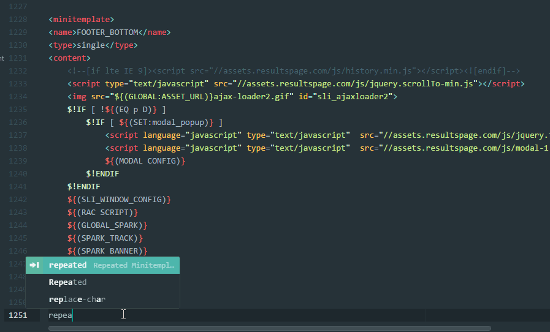

# Atom Template Builder Tools

This is a collection of tools to make working with Template Builder clients and components much easier.

## Installation

Install through the UI or with:

```
apm install atom-templatebuilder-tools
```

Then fire up Atom.

## Features

### Syntax Highlighting

#### Localbrain config

This will highlight the lb_search.conf.template file to make it much more readable

#### HTML Files

This will look for ${(SOMETHING)} style tags and highlight them separate within HTML files.

### Snippets

TODO: Add the $!IF constructs

#### Template Blocks

Type in repeated and hit tab in your minitemplate file to see this in action. Types available are single, repeated.



TODO: Add replace-char, replace-str, extra headers see LocalBrain Minitemplate wiki for details

# LB Search conf linter questions

   * Are section names case sensitive ?
   * What are the required sections ?

#### Minitemplate modifiers

You can use the following snippets to fill in the tag for an existing template. Note these are all set to the opposite of the default as the assumption is that you'd only add these if you wanted to override the default values.

input, empty, trim, stop, skip, skipnot, define, definelist
